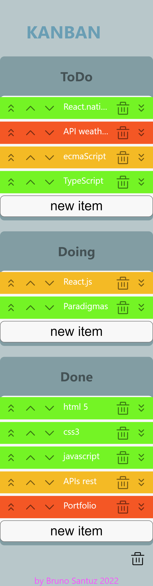
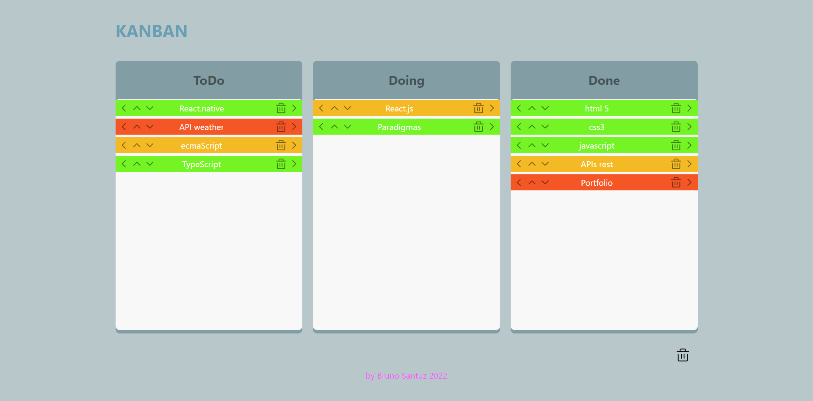

# kanban
<p align="center">Listas de tarefas: a fazer, fazendo e feito.
O objetivo é deixar o processo mais fácil e rápido. </p>
<h4 align="center"> Status do projeto: Concluido</h4>

### Tabela de conteudo

<p align="center">
<a href="#funcionalidades">funcionalidades</a> • 
<a href="#Demostração-da-Aplicação">Demostração</a> • 
<a href="#Como-executar-o-projeto">como Executar</a> • 
<a href="#Tecnologias-utilizadas">Tecnologias</a> •   
<a href="#autor">Autor</a> •
<a href="#licença">Licença</a> 
</p>

### funcionalidades

- [x] 3 listas:to do, doing, done
- [x] Passar as tarefas de uma lista para a outra
- [x] Salvar e deletar as informações do kanban

### Demostração da Aplicação
1 - Clique no botão “new item” para criar uma tarefa.
2 - Coloque um título, uma descrição e escolha uma cor e salve.
A lista é salva automaticamente no LocalStorage, podendo sair do site que não perdera as informações.
3 - Através do menu dos itens pode-se mover a tarefa entre as listas.
<br>
<a href="#">Teste a aplicação<a>




### Como executar o projeto
Antes de começar, você precisará ter instalado em sua máquina as seguintes ferramentas:

Além disto é bom ter um editor para trabalhar com o código como [VSCode](https://code.visualstudio.com/)

```bash
# Clone este repositório
$ git clone <>

# Acesse a pasta do projeto no terminal/cmd
$ cd ...

# Instale as dependências
$ npm install ...

# Execute a aplicação 
$ npm start

# inciará na porta:3333 - acesse <http://localhost:3333>
```
            

### Tecnologias utilizadas

* Front-End Basic(HTML5, CSS#, Javascript)
* React.js
* SCSS
* Figma

### Autor
Feito com ❤️ por Bruno de Souza Soares dos Santos 👋🏽 Entre em contato!

email: developer@brunosantuz.com

### Licença
MIT License
